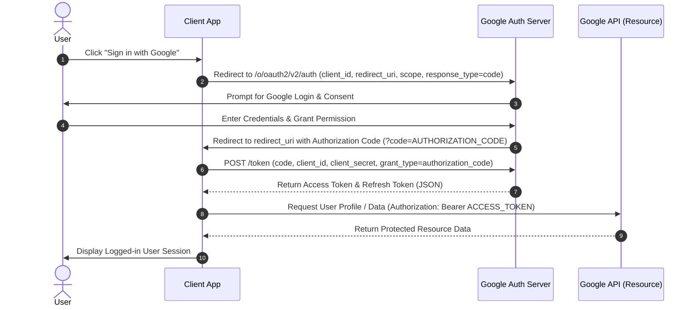

Authorization Diagram
We are using the Google OAuth and Google API for our application.

```mermaid
sequenceDiagram
    autonumber
    actor User as User
    participant App as Client App
    participant Google as Google Auth Server
    participant API as Google API (Resource)

    User->>App: Click "Sign in with Google"
    App->>Google: Redirect to /o/oauth2/v2/auth (client_id, redirect_uri, scope, response_type=code)
    Google->>User: Prompt for Google Login & Consent
    User->>Google: Enter Credentials & Grant Permission
    Google->>App: Redirect to redirect_uri with Authorization Code (?code=AUTHORIZATION_CODE)
    App->>Google: POST /token (code, client_id, client_secret, grant_type=authorization_code)
    Google-->>App: Return Access Token & Refresh Token (JSON)
    App->>API: Request User Profile / Data (Authorization: Bearer ACCESS_TOKEN)
    API-->>App: Return Protected Resource Data
    App->>User: Display Logged-in User Session

```
