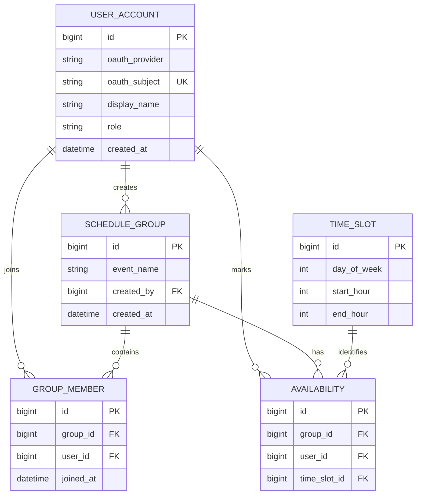

# <API name> Proposal

## 1. The pitch
This API helps groups find a time when everyone is available for an event. Users can join a scheduling group, view the week in one-hour time slices, and mark the hours when they are available. The API calculates and exposes availability data so that a Kotlin Android client can display the times that work best for the group. Users authenticate through OAuth2, and administrators can manage users and groups.

## 2. Resources
| Resource | Key fields | Relationships |
|---|---|---|
| User | id, oauthProvider, oauthSubject, displayName, role, createdAt | A User can belong to many ScheduleGroups and mark many Availability records |
| ScheduleGroup | id, eventName, createdBy, createdAt | A ScheduleGroup has many Users through GroupMember and many Availability records |
| GroupMember | id, groupId, userId, joinedAt | Connects Users and ScheduleGroups |
| TimeSlot | id, dayOfWeek, startHour, endHour | A TimeSlot can be used by many Availability records |
| Availability | id, groupId, userId, timeSlotId | Connects a User, ScheduleGroup, and TimeSlot |

## 3. ER sketch
Tables, primary and foreign keys, and cardinality. Edit this Mermaid diagram (it renders on GitHub;
try changes at https://mermaid.live):

## 4. Endpoints
| Verb | Path | Auth | Purpose |
|---|---|---|---|
| GET | `/api/v1/time-slots` | `public` | List the 168 standard weekly one-hour time slots |
| GET | `/api/v1/groups?page=0&size=20&sort=createdAt,desc` | `user` | List groups the current user belongs to; paginated and sortable |
| POST | `/api/v1/groups` | `user` | Create a new scheduling group |
| GET | `/api/v1/groups/{groupId}` | `user` | View one scheduling group |
| PUT | `/api/v1/groups/{groupId}` | `user` | Replace all editable details for a group |
| PATCH | `/api/v1/groups/{groupId}` | `user` | Partially update group details, such as the event name |
| DELETE | `/api/v1/groups/{groupId}` | `user` | Delete a group owned by the current user |
| GET | `/api/v1/groups/{groupId}/members` | `user` | List the members of a group |
| POST | `/api/v1/groups/{groupId}/members` | `user` | Add the current user to a group |
| DELETE | `/api/v1/groups/{groupId}/members/me` | `user` | Remove the current user from a group |
| PUT | `/api/v1/groups/{groupId}/availability/me` | `user` | Replace the current user’s availability selections for a group |
| GET | `/api/v1/groups/{groupId}/availability` | `user` | View individual availability selections for a group |
| GET | `/api/v1/groups/{groupId}/availability/summary?sort=percentage,desc&dayOfWeek=1` | `user` | Show each time slot’s availability percentage; supports sorting and filtering |
| GET | `/api/v1/users/me` | `user` | View the current user’s application profile |
| GET | `/api/v1/users` | `admin` | List all users |
| GET | `/api/v1/users/{userId}` | `admin` | View one user |
| PATCH | `/api/v1/users/{userId}` | `admin` | Update a user’s role or profile information |
| DELETE | `/api/v1/users/{userId}` | `admin` | Delete a user and their related application data |
| DELETE | `/api/v1/users/me` | `user` | Delete the current user’s account and related application data |

## 5. Technical choices

- **Database host:** TBD (not talked about yet)
- **OAuth2 provider:** Google. Google supports the Authorization Code flow with PKCE for native Android applications. The Android client will authenticate the user, and the Spring Boot API will validate the resulting bearer token as an OAuth2 Resource Server.
- **Repo layout:** Split repositories. The API and Android app are stored in separate repositories so they can be developed, tested, and deployed independently. The API is the primary project deliverable, while the Android app will act as a client demonstration.
These become your ADRs later.

## 6. Risks

1. **OAuth2/PKCE configuration may be difficult to connect between Google, the Android app, and the Spring Boot API.** We will test Google login and one protected API endpoint early in development before building the rest of the application.
2. **The relationships between users, groups, time slots, and availability may produce incorrect availability summaries.** We will review the ER diagram and test the percentage calculation using a small set of sample users and time slots before implementing all endpoints.

## 7. Team and Sprint 1

Team responsibilities have not yet been finalized. The team will assign Sprint 1 tasks at some point.

Planned Sprint 1 tasks include:
- Choose the hosted database provider
- Finalize the OpenAPI contract
- Define the common error response
- Set up the GitHub Project board and Sprint 1 milestone
- Create the initial Spring Boot API structure

Project board: https://github.com/users/Cooper-W-04/projects/3/views/1

Sprint 1 milestone: TBD

