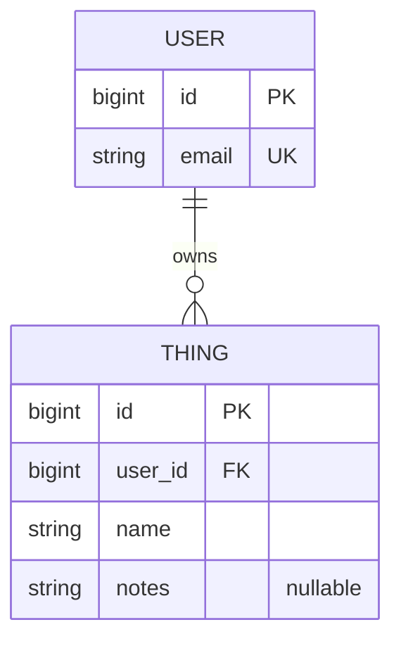

# <API name> Proposal

## 1. The pitch (one paragraph) SoCalender (Alyosha-ctrl)
SoCalender will be an API that allows you to setup events by the day, and hours, and see when everyone in a group can attend an event. Stored in a 2d array ui element with a number for how many can be there at that hour(military time) for convenient event time handling. You will be able to view events with a key, and edit your availability after the fact. Admins will be able to edit users, and delete them, while seeing everyone. As a stretch goal we will make a button that runs an algorithm to choose the best time to meet with the most people available according to the duration of an event.

## 2. Resources
| Resource | Key fields | Relationships |
|---|---|---|
| User | id, email, displayName, role | a User has many Workouts |
| ... | ... | ... |

## 3. ER sketch (hypermarx)
Tables, primary and foreign keys, and cardinality. Edit this Mermaid diagram (it renders on GitHub;
try changes at https://mermaid.live):

## 4. Endpoints (everyone)
| Verb | Path | Auth | Purpose |
|---|---|---|---|
| GET | /api/v1/workouts?page=0&size=20 | user | list my workouts (paginated) |
| ... | ... | ... | ... |
Mark each endpoint `public`, `user`, or `admin`. Mark which collection paginates and which
filters or sorts.

## 5. Technical choices (Cooper)
- **Database host:** (Neon, Supabase, Railway, Atlas, ...) and why
- **OAuth2 provider:** (Google, GitHub, Auth0) and confirmation that it supports Authorization Code + PKCE from a native app
  Google, and yes it does.
- **Repo layout:** Split. 
These become your ADRs later.

## 6. Risks
The two things most likely to go wrong, and what you will do first to find out.

## 7. Team and Sprint 1
Who owns what in Sprint 1. Link your Project board and Sprint 1 milestone.
Authorization diagram Alyosha-ctrl
Er Diagram hypermarx
ADR's Cooper
